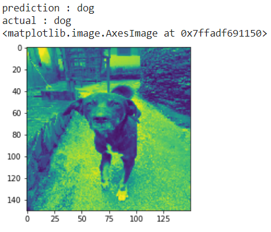

# SOC WNCC IITB

## CheckPoint 1

---

### Problem :

Given a dataset of dogs and cats images, we need to implement a CNN model which could classify the dogs and cats images.

### Implemented in :

Jupyter Notebook

### Frameworks used :

* TensorFlow
* Numpy
* OpenCV
* Matplotlib

### Data preprocessing

Dataset contains 1500 images of each category (dog and cat). It is splitted as 2/3 train and 1/3 validation that is train set has 1000 images and validation set has 500 images pf each category. Each image is read in grayscale mode and the pixel values are normalized between 0 and 1.

### Architecture

Implemented three different models with some changes in the convolutional layers which is flattened out and connected to a hidden layer of size 128 and give the output in the final layer of size 2.

NETWORK PARAMETER

* Rectifier Linear Unit
* Adam optimzer
* Binary CrossEntropy loss
* Softmax on final output

### Results

| Model No. 	| Architecture (Number and Size of Filters) 	| Epochs 	| Acc 	| Loss 	| Val_Acc 	| Val_Loss 	| image1 	| image2 	| image3 	|
|-	|-	|-	|-	|-	|-	|-	|-	|-	|-	|
| 1  	| 8,3 `<br>`32,3 `<br>`64,3 	| 10 	| 0.9376 	| 0.1603 	| 0.69 	| 1.1424 	|  	|  	|  	|
| 2 (best)	| 32,3 `<br>`64,3 `<br>`128,3 `<br>`256,3 	| 20 	| 1.0000 	| 0.0027 	| 0.7550 | 1.5612 	| 0 	| 1 	| 1 	|
| 3 	| 8,2 `<br>`32,2 `<br>`64,2 `<br>`128,2 	| 20 	| 0.9526 	| 0.1256 	| 0.71 	| 1.5257 	|  	|  	|  	|

* Test 1 :


* Test2 :


* Test3 :



<hr>
<br><br>
<h1>Checkpoint 2</h1>

<div>
<p><strong>Implementing the YOLO based convolutional neural networks model to detect objects in a frame.</strong></p>
</div>

### Model Used

YOLOV5

### Implemented on

Local
Remote, (Google Colab)

### Execution

* Cloning the repository
  
  ```python
  !git clone https://github.com/ultralytics/yolov5
  ```
* Install the dependencies (on local)
  
  ```python
  pip install -r requirements.txt
  ```
* Set the current directory to yolov5
  
  ```python
  %cd yolov5
  ```
* Runs the inference on the example images, downloading models automatically from the [latest YOLOv5 release](https://github.com/ultralytics/yolov5/releases) and saving results to `runs/detect`.
  
  ```python
  python detect.py --source data/images --weights yolov5s.pt --conf 0.25
  ```
* Other sources such as live camera and videos can also be given for the real time object detection.
  
  ```python
  python detect.py --source 0  #webcam
  python detect.py --source 'https://youtu.be/NUsoVlDFqZg' # youtube video
  ```

### Results

Image

```python
Image(filename = "runs\detect\exp\zidane.jpg" , width = 600)
```

<div></div>

Video

Original Video : [Street View](https://www.youtube.com/watch?v=P54ruJHZvQI&ab_channel=AdamBelkoAdamBelko)

Object Detection

<figure class="video_container">
<video controls="true" allowfullscreen="true" poster = "resources/zidane.jpg">
<source src="resources/video.mp4" type="video/mp4">
</video>
</figure>

