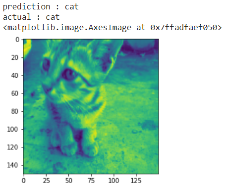

# SOC WNCC IITB

<h3>Project Structure</h3>

<p>SOC_Cats_vs_Dogs.ipynb is the file for the first checkpoint which implements a CNN on cats Vs dogs dataset.</p>
<p>The directory as a whole is a flask project directory. App.py is the main file to run the flask app. Static files contains the css and images for the frontend, while templates has the html templates which are used by flask.</p>
<p>Rest files utilities and other files of yolov5 for the object detection </p>


## CheckPoint 1

---

### Problem :

Given a dataset of dogs and cats images, we need to implement a CNN model which could classify the dogs and cats images.

### Implemented in :

Jupyter Notebook

### Frameworks used :

* TensorFlow
* Numpy
* OpenCV
* Matplotlib

### Data preprocessing

Dataset contains 1500 images of each category (dog and cat). It is splitted as 2/3 train and 1/3 validation that is train set has 1000 images and validation set has 500 images pf each category. Each image is read in grayscale mode and the pixel values are normalized between 0 and 1.

### Architecture

Implemented three different models with some changes in the convolutional layers which is flattened out and connected to a hidden layer of size 128 and give the output in the final layer of size 2.

NETWORK PARAMETER

* Rectifier Linear Unit
* Adam optimzer
* Binary CrossEntropy loss
* Softmax on final output

### Results

| Model No. 	| Architecture (Number and Size of Filters) 	| Epochs 	| Acc 	| Loss 	| Val_Acc 	| Val_Loss 	| image1 	| image2 	| image3 	|
|-	|-	|-	|-	|-	|-	|-	|-	|-	|-	|
| 1  	| 8,3 `<br>`32,3 `<br>`64,3 	| 10 	| 0.9376 	| 0.1603 	| 0.69 	| 1.1424 	|  	|  	|  	|
| 2 (best)	| 32,3 `<br>`64,3 `<br>`128,3 `<br>`256,3 	| 20 	| 1.0000 	| 0.0027 	| 0.7550 | 1.5612 	| 0 	| 1 	| 1 	|
| 3 	| 8,2 `<br>`32,2 `<br>`64,2 `<br>`128,2 	| 20 	| 0.9526 	| 0.1256 	| 0.71 	| 1.5257 	|  	|  	|  	|

* Test 1 :


* Test2 :



* Test3 :


<hr>
<br><br>
<h1>Checkpoint 2</h1>

<div>
<p><strong>Implementing the YOLO based convolutional neural networks model to detect objects in a frame.</strong></p>
</div>

### Model Used

YOLOV5

### Implemented on

Local <br>
Remote, (Google Colab)

### Execution

* Cloning the repository
  
  ```python
  !git clone https://github.com/ultralytics/yolov5
  ```
* Install the dependencies (on local)
  
  ```python
  pip install -r requirements.txt
  ```
* Set the current directory to yolov5
  
  ```python
  %cd yolov5
  ```
* Runs the inference on the example images, downloading models automatically from the [latest YOLOv5 release](https://github.com/ultralytics/yolov5/releases) and saving results to `runs/detect`.
  
  ```python
  python detect.py --source data/images --weights yolov5s.pt --conf 0.25
  ```
* Other sources such as live camera and videos can also be given for the real time object detection.
  
  ```python
  python detect.py --source 0  #webcam
  python detect.py --source 'https://youtu.be/NUsoVlDFqZg' # youtube video
  ```

### Results

Image

```python
Image(filename = "runs\detect\exp\zidane.jpg" , width = 600)
```

<div></div>

<br>

Video

Original Video : [Street View](https://www.youtube.com/watch?v=P54ruJHZvQI&ab_channel=AdamBelkoAdamBelko)

Object Detection

https://user-images.githubusercontent.com/63975127/122248105-77f04600-cee5-11eb-949c-9563c0e8f8f3.mp4

### Reference

[Github](https://github.com/ultralytics/yolov5)

<hr>

<h1>Checkpoint 3</h1>

Integrating the yolov5 model with the flask and implemeting real time object detection on the web.

## Framework

Flask

## Execution

```python
!python app.py --source "resources/data/images"  #add your image here
                        "https://www.youtube.com/watch?v=z-rUrs5Ida8&ab_channel=JordanMaronJordanMaron"   #youtube
                        0   #live stream
```

Start the local host

## Results

https://user-images.githubusercontent.com/63975127/122246694-665a6e80-cee4-11eb-9a90-10768e542c7b.mp4

<hr>

<h1>Checkpoint 4</h1>

Adding features to the website.

<h5>Feature 1</h5>

Displaying the no. of objects displayed per frame along with the frame.

<br>


<h5>Feature 2<h5>

Displaying a graph which shows the caregories detected so far and new detection in each category.
  
<br>
  


<h5>Feature 3</h5>

Saving the data to the pd dataFrame and converting it to excel at the end of inference.
  
<br>  
  


Data includes :-

* Time of occurence of each frame
* No. of objects detected in each frame
* Number of objects of each category detected per frame
* Coordinates of bounding box of each object detected per frame.

The data.csv file is saved in the runs folder after each completed inference.

<h3>Summary</h3>

The main objective of the project was to implement object detection using model of YOLO family and execute it to the web using web frameworks.
Starting with brushing up Python and it's libraries - openCV, keras, matplotlib, pandas and numpy which were going to be used in the project, we learnt concepts of CNN and execute it on a datset.  
After that we used the yolov5 model to detect objects in a video, image or live stream.
Next we learnt flask and executed our model to web.For this, we copied the contents of detect.py which is the main file of yolov5 model to the app.py.In the app.py file, the detect funtion yields the frames after the object detection of a video or image. That generator is given to the html template to display the frames using Response class of flask.  
For the features, we kept track of number of objects detected in each frame in a variable and write that variable to the frame before passing that frame in the generator.For the graph, I used a global variable in which name of categories and number of new detections is stored,which is passed in the form of generator to a html template which recieve that data and displays it using chart.js library and that template is displayed in the main template using iframe.


<h1>Future Goals</h1>

* <p>Implementation of custom object detection unlike the current which could detect only certain categories </p>
* <p> The model could be run bu running the flask app from terminal and giving the source, the aim is to give a window to upload the files on the website along with a start/stop button to start and stop the object detection.
* <p>Only saving the frames in which a particular object of choice is detected.</p>
* <p>Finding a fast and better way to display frames on website</p>

